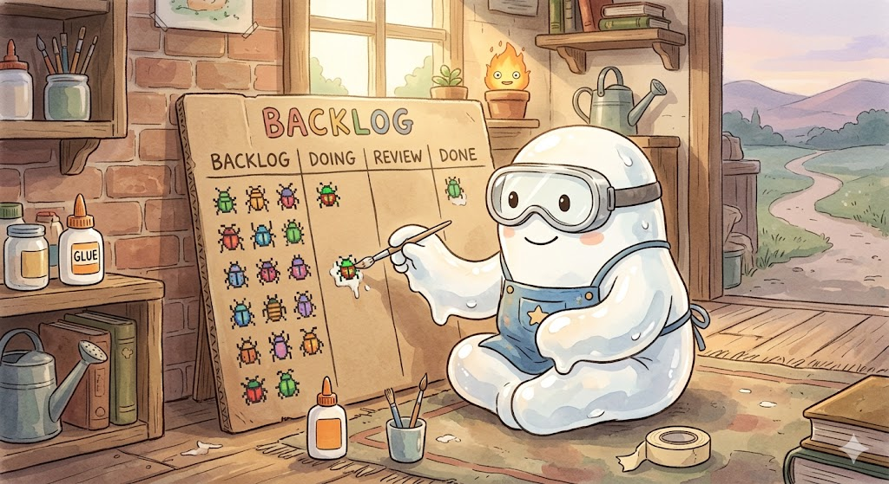

# GluePasteDev



A visual Kanban board that turns your coding tasks into automated AI sessions. Add cards, hit play, and Claude CLI builds your features one by one.

## What it does

You create a board for a project, add cards describing what you want built, and GluePasteDev runs them sequentially through Claude Code. Each card goes through a plan phase, then an execution phase. If something fails, it retries once and stops. You can add comments to cards to give the AI feedback ("not what I expected, try X"), and the next run includes that context.

## Key features

- **Kanban dashboard** — 5-column board (Todo, Queued, In Progress, Done, Failed) with real-time WebSocket updates
- **Sequential execution** — Play a single card or hit Play All to run the whole board card by card
- **2-phase runs** — Each card gets a plan phase (Claude thinks), then an execute phase (Claude codes) with auto-permissions
- **Comment feedback loop** — User and AI comments on cards carry context between runs
- **Per-project config** — Model, budget, custom tags, instructions. Project settings override global defaults
- **Resilient daemon** — Background process with auto-restart on crash, exponential back-off, log file
- **Tag system** — Default tags (UX, design, backend, logic) plus custom tags per project

## Current status

**Alpha** — Core architecture is in place. The Kanban board, API, executor, CLI daemon, and comment system all work. Drag-and-drop reordering and the embedded terminal view (xterm.js) are next.

## Install

```bash
curl -fsSL https://raw.githubusercontent.com/desduvauchelle/glue-paste-dev/main/scripts/install.sh | bash
```

Requires [Bun](https://bun.sh) (installed automatically if missing) and [Claude CLI](https://docs.anthropic.com/en/docs/claude-code).

## Desktop App

A standalone macOS/Linux desktop app built with [Electron](https://www.electronjs.org/) (Chromium window + Node.js). No terminal needed — double-click to open. The app lives in the system tray; on macOS closing the window hides it rather than stopping the server.

### Install (end users)

```bash
curl -fsSL https://raw.githubusercontent.com/desduvauchelle/glue-paste-dev/main/scripts/install-electron.sh | bash
```

This downloads the latest release, installs `GluePaste.app` to `/Applications/`, and removes the macOS quarantine flag so the app opens without a security warning.

**Requirements:** macOS 12+ or Linux. No other dependencies — the server is bundled inside the app.

> **Note:** The app is unsigned. The install script runs `xattr -cr /Applications/GluePaste.app` automatically to clear the macOS quarantine flag. If you move the app manually, run that command yourself.

### Open the app

On **macOS**: open Spotlight (`Cmd+Space`), type `GluePaste`, press Enter.

On **Linux**: run `GluePaste` in a terminal, or find it in your application launcher.

**On macOS**, closing the window hides the app — the server keeps running in the background. Right-click the tray icon and choose **Quit** to fully stop everything. **On Linux**, closing the window stops the server and quits.

### Build the desktop app (developers)

Prerequisites: [Bun](https://bun.sh) and Node.js installed.

```bash
# One-time: install Electron dependencies
cd packages/electron && npm install

# Build dashboard + compile server binary + package the app
bun run build:electron
```

Artifacts are written to `packages/electron/dist-app/`. The first build takes a few minutes to compile the server binary.

### Dev mode

First compile the Electron main process, then start the services in separate terminals:

```bash
# One-time per session — compile Electron TypeScript
cd packages/electron && npx tsc

# Terminal 1 — API server
bun run dev:server

# Terminal 2 — Dashboard (Vite)
bun run dev:dashboard

# Terminal 3 — Electron window
bun run dev:electron
```

The Electron window loads `http://localhost:4242`. Hot-reload works for the dashboard via Vite; re-run `npx tsc` and restart `dev:electron` if you change the main process (`packages/electron/src/main.ts`).

### How the desktop app works

1. The Electron main process spawns the compiled Hono server binary as a subprocess
2. A loading window is shown while it polls `http://localhost:4242/api/boards` (up to 20 s)
3. Once the server responds, the loading window closes and the main browser window opens
4. A system tray icon provides "Open GluePaste" and "Quit" menu options
5. On macOS: closing the main window hides it — the server keeps running. Use **Quit** from the tray to stop everything.
6. On Linux: closing all windows stops the server and quits the app.

In production, the pre-compiled server binary and built dashboard are bundled inside the app package under `packages/electron/resources/`.

## Usage

```bash
# Start the daemon (opens browser automatically)
glue-paste-dev start

# Check status
glue-paste-dev status

# View logs (follow mode)
glue-paste-dev logs -f

# Open dashboard (starts daemon if not running)
glue-paste-dev open

# Restart
glue-paste-dev restart

# Stop
glue-paste-dev stop

# Update to latest version
glue-paste-dev update
```

The dashboard runs at **http://localhost:4242**.

## How it works

1. Create a board — give it a name and point it at a project directory
2. Add cards — title, description, tags
3. Click Play on a card (or Play All for the whole board)
4. GluePasteDev spawns `claude -p` in your project directory with a prompt built from the card
5. Plan phase runs first (Claude analyzes the task), then execute phase (Claude writes code with `--dangerously-skip-permissions`)
6. Results stream to the dashboard in real-time via WebSocket
7. System auto-adds a comment with the result. If it failed, add your feedback and run again.

## Development

```bash
# Install dependencies
bun install

# Run server (hot reload)
bun run dev:server

# Run dashboard (Vite dev server with proxy to :4242)
bun run dev:dashboard

# Run tests
bun test --cwd packages/core

# Build everything
bun run build
```

## Architecture

Bun monorepo with 4 packages:

| Package | What |
|---------|------|
| `packages/core` | Zod schemas, SQLite DB, executor, config manager |
| `packages/server` | Hono HTTP + WebSocket API |
| `packages/dashboard` | React + Tailwind + shadcn-style UI |
| `packages/cli` | `glue-paste-dev` daemon commands |
| `packages/electron` | Electron desktop app — browser window, tray icon, server lifecycle |

Data lives in `~/.glue-paste-dev/` (SQLite database, PID file, logs).
